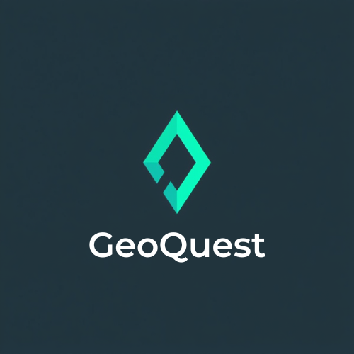
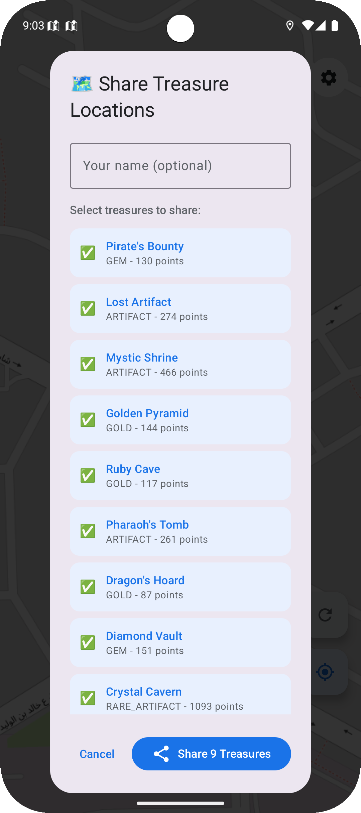
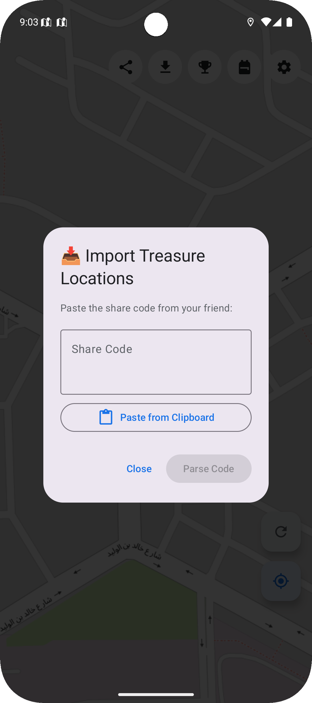
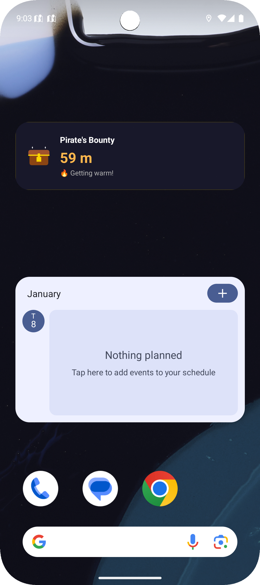

<p align="center">
  
</p>

# 🗺️ GeoQuest - GPS Treasure Hunt Game

A location-based Android game where players hunt for virtual treasures at real-world coordinates. Built with modern Android development practices demonstrating proficiency in GPS/Location services, Geofencing, and clean architecture.

## Screenshots

<p align="center">
  
  
  
  
</p>

<p align="center">
  
  
  
</p>

<p align="center">
  
  
  
</p>

## 🎮 Features

### Core Gameplay
- **Interactive Map** - OpenStreetMap integration with OSMDroid (no API key required)
- **Real-time Location Tracking** - FusedLocationProviderClient for accurate GPS
- **Geofencing API** - System-level proximity detection (100m radius)
- **"Hot & Cold" Navigation** - Visual and haptic feedback as you approach treasures
- **Treasure Collection** - Collect treasures when within 20 meters
- **Inventory System** - View collected treasures in backpack
- **Dynamic Treasure Spawning** - Treasures spawn randomly around user's location
- **Respawn Treasures** - Button to generate new treasure locations

### Social Features
- **Share Treasures** - Share treasure coordinates with friends via any app (WhatsApp, Twitter, etc.)
- **Import Treasures** - Import treasure locations shared by friends using encoded share codes
- **Share Achievements** - Brag about unlocked achievements on social media

### Home Screen Widget
- **Distance Widget** - Shows real-time distance to selected treasure on home screen
- **Proximity Indicator** - Color-coded distance with emoji status (❄️ Freezing → 🎯 You're there!)
- **Quick Access** - Tap widget to open the app
- **Unit Support** - Respects metric/imperial settings

### Technical Features
- **Foreground Service** - Background tracking with persistent notification
- **Proximity Notifications** - Get notified when near a treasure
- **Achievement System** - Unlockable achievements (First Find, Explorer, Speed Runner, etc.)
- **User Statistics** - Track distance walked, treasures collected, points earned
- **GPS Status Monitoring** - Detects GPS on/off changes with prompts
- **Dark/Light Theme** - Full theme support with system default option
- **Settings** - Haptic feedback, sound effects, notifications, distance units

## 🛠️ Tech Stack

| Technology | Purpose |
|------------|---------|
| **Kotlin** | Primary language |
| **Jetpack Compose** | Declarative UI |
| **Material 3** | Modern UI components |
| **Hilt** | Dependency Injection |
| **Room** | Local database |
| **DataStore** | Preferences storage |
| **Kotlin Flows/StateFlow** | Reactive state management |
| **OSMDroid** | OpenStreetMap SDK (free) |
| **FusedLocationProvider** | GPS location services |
| **Geofencing API** | Proximity detection |
| **Foreground Service** | Background processing |
| **BroadcastReceiver** | System events (Boot, Geofence, GPS) |
| **Navigation Compose** | Screen navigation |
| **AppWidgetProvider** | Home screen widget |

## Architecture

```
┌──────────────────────────────────────────────────────────────────────────┐
│                              UI Layer                                     │
│  ┌─────────────┐  ┌─────────────┐  ┌─────────────┐  ┌─────────────────┐  │
│  │  MapScreen  │  │  Backpack   │  │ Achievements│  │    Settings     │  │
│  └──────┬──────┘  └──────┬──────┘  └──────┬──────┘  └────────┬────────┘  │
│         │                │                │                   │           │
│  ┌──────┴──────┐  ┌──────┴──────┐  ┌──────┴──────┐  ┌────────┴────────┐  │
│  │GameViewModel│  │InventoryVM │  │AchievementVM│  │  SettingsVM     │  │
│  └──────┬──────┘  └──────┬──────┘  └──────┬──────┘  └────────┬────────┘  │
└─────────┼────────────────┼────────────────┼──────────────────┼───────────┘
          │                │                │                  │
┌─────────┼────────────────┼────────────────┼──────────────────┼───────────┐
│         │           Domain/Data Layer     │                  │           │
│  ┌──────┴──────┐  ┌──────┴──────┐  ┌──────┴──────┐  ┌────────┴────────┐  │
│  │ LocationRepo│  │InventoryRepo│  │AchievementRp│  │  UserPrefsRepo  │  │
│  └──────┬──────┘  └─────────────┘  └─────────────┘  └─────────────────┘  │
│         │                                                                 │
│  ┌──────┴──────┐  ┌───────────────────────────────────────────────────┐  │
│  │FusedLocation│  │              Room Database                        │  │
│  │  Provider   │  │  (InventoryDao, AchievementDao, UserStatsDao)     │  │
│  └─────────────┘  └───────────────────────────────────────────────────┘  │
└──────────────────────────────────────────────────────────────────────────┘

┌──────────────────────────────────────────────────────────────────────────┐
│                     Background Services & Widget                          │
│  ┌─────────────────────┐  ┌───────────────────────────────────────────┐  │
│  │ GeofenceMonitor     │  │           BroadcastReceivers              │  │
│  │    Service          │  │  ┌─────────────┐  ┌─────────────────────┐ │  │
│  │  (Foreground)       │  │  │BootReceiver │  │GeofenceBroadcast    │ │  │
│  │                     │  │  │             │  │    Receiver         │ │  │
│  └──────────┬──────────┘  │  └─────────────┘  └─────────────────────┘ │  │
│             │             │  ┌─────────────────────────────────────┐   │  │
│             │             │  │       GpsStatusReceiver             │   │  │
│  ┌──────────┴──────────┐  │  └─────────────────────────────────────┘   │  │
│  │  TreasureDistance   │  └───────────────────────────────────────────┘  │
│  │      Widget         │                                                  │
│  │ (AppWidgetProvider) │                                                  │
│  └─────────────────────┘                                                  │
└──────────────────────────────────────────────────────────────────────────┘

┌──────────────────────────────────────────────────────────────────────────┐
│                            Utilities                                      │
│  ┌─────────────────────┐  ┌───────────────┐  ┌─────────────────────────┐ │
│  │   GeofenceManager   │  │ SoundManager  │  │ ProximityNotification   │ │
│  │  (Geofencing API)   │  │               │  │      Manager            │ │
│  └─────────────────────┘  └───────────────┘  └─────────────────────────┘ │
│  ┌─────────────────────┐  ┌───────────────┐  ┌─────────────────────────┐ │
│  │HapticFeedbackManager│  │ ShareManager  │  │    TreasureSpawner      │ │
│  └─────────────────────┘  └───────────────┘  └─────────────────────────┘ │
└──────────────────────────────────────────────────────────────────────────┘
```

**Pattern:** MVVM (Model-View-ViewModel)  
**DI:** Hilt  
**State:** Kotlin StateFlow with single UI state pattern  
**Background:** Foreground Service + BroadcastReceivers + AppWidget

## 📱 Screens

| Screen | Description |
|--------|-------------|
| **Map** | Main game view with treasures, location, and controls |
| **Backpack** | Inventory of collected treasures |
| **Achievements** | Progress and unlocked achievements with share option |
| **Settings** | App preferences and theme |
| **Permissions** | Location permission flow |
| **Share Dialog** | Select and share treasure locations with friends |
| **Import Dialog** | Paste and import treasure codes from friends |
| **Widget** | Home screen widget showing distance to selected treasure |

## 🚀 Getting Started

### Prerequisites
- Android Studio Hedgehog or newer
- Android SDK 28+ (Android 9.0)
- Physical device recommended for GPS testing

### Installation

```bash
git clone https://github.com/yourusername/GeoQuest.git
cd GeoQuest
```

Open in Android Studio → Sync Gradle → Run

> **Note:** No API keys required! Uses free OpenStreetMap.

### Required Permissions

| Permission | Purpose |
|------------|---------|
| `ACCESS_FINE_LOCATION` | Precise GPS |
| `ACCESS_COARSE_LOCATION` | Approximate location |
| `ACCESS_BACKGROUND_LOCATION` | Background tracking (Android 10+) |
| `POST_NOTIFICATIONS` | Proximity alerts (Android 13+) |
| `FOREGROUND_SERVICE_LOCATION` | Background service |
| `RECEIVE_BOOT_COMPLETED` | Re-register geofences after reboot |

## 📁 Project Structure

```
app/src/main/java/com/compose/geoquest/
├── GeoQuestApplication.kt
├── MainActivity.kt
├── data/
│   ├── local/                  # Room database & DAOs
│   ├── model/                  # Data models
│   ├── preferences/            # DataStore preferences
│   └── repository/             # Repositories
├── di/                         # Hilt modules
├── receiver/                   # BroadcastReceivers
│   ├── BootReceiver.kt
│   ├── GeofenceBroadcastReceiver.kt
│   └── GpsStatusReceiver.kt
├── service/                    # Foreground service
│   └── GeofenceMonitorService.kt
├── widget/                     # Home screen widget
│   └── TreasureDistanceWidget.kt
├── util/                       # Utility classes
│   ├── GeofenceManager.kt
│   ├── HapticFeedbackManager.kt
│   ├── ProximityNotificationManager.kt
│   ├── ShareManager.kt         # Treasure & achievement sharing
│   └── SoundManager.kt
└── ui/
    ├── game/                   # Map & game logic
    ├── inventory/              # Backpack
    ├── achievements/           # Achievements
    ├── settings/               # Settings
    ├── components/             # Reusable components
    │   ├── AchievementNotification.kt
    │   └── TreasureSharingDialogs.kt
    ├── navigation/             # Navigation
    └── theme/                  # Theme & colors
```

## 🎯 Skills Demonstrated

- **Android Jetpack** - Compose, Room, DataStore, Navigation, Hilt
- **Location Services** - FusedLocationProvider, Geofencing API
- **Background Processing** - Foreground Service, BroadcastReceivers
- **App Widgets** - AppWidgetProvider, RemoteViews, widget updates
- **Reactive Programming** - Kotlin Flows, StateFlow, combine operators
- **Clean Architecture** - MVVM, Repository pattern, Dependency Injection
- **Modern Kotlin** - Coroutines, Sealed classes, Extension functions
- **Sharing/Intents** - Share sheet integration, data encoding/decoding
- **Accessibility** - Screen reader support, semantic content descriptions

## ♿ Accessibility Features

GeoQuest is built with accessibility in mind:

| Feature | Implementation |
|---------|----------------|
| **Screen Reader Support** | All UI components have semantic content descriptions |
| **Heading Structure** | Proper heading hierarchy for navigation |
| **State Descriptions** | Toggle states, button states clearly announced |
| **Live Regions** | Achievement notifications announced immediately |
| **Merged Descendants** | Complex cards read as single coherent items |
| **Role Annotations** | Buttons, switches, dropdowns properly identified |
| **Haptic Feedback** | Physical vibrations for proximity (configurable) |
| **High Contrast** | Material 3 theming with good color contrast |

## 📄 License

MIT License - see [LICENSE](LICENSE) file.
