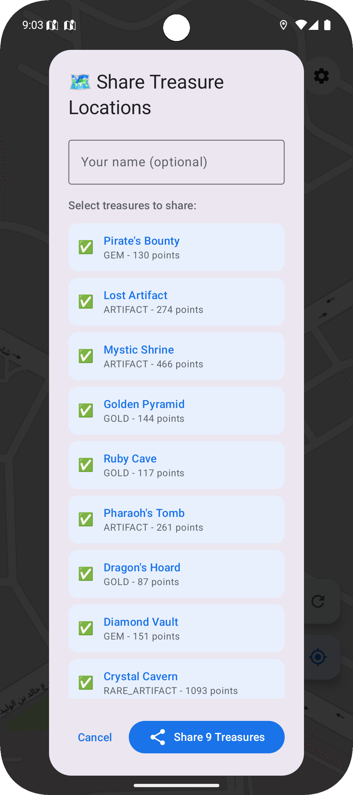
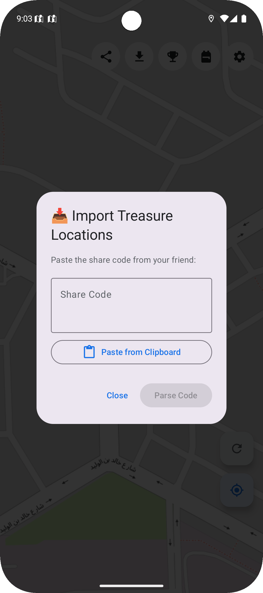

<p align="center">
  
</p>

# GeoQuest - GPS Treasure Hunt Game

An Android app where you hunt for virtual treasures hidden at real-world GPS coordinates. Walk around, get close to a treasure, and collect it. Built with Jetpack Compose, OSMDroid, and Google's Geofencing API.

No API keys needed — uses free OpenStreetMap tiles.

## Screenshots

<p align="center">
  
  
  
  
</p>

<p align="center">
  
  
  
  
</p>

<p align="center">
  
  
  
</p>

## How it works

- Treasures spawn randomly around your location (100m-1km away)
- Tap a treasure on the map to start navigating toward it
- The app shows distance and a "hot & cold" indicator as you walk closer
- When you're within 20 meters, you can open the chest and collect the reward
- Each treasure gives you a random reward (gold, gems, artifacts) worth points

## Features

**Map & Navigation**
- OpenStreetMap via OSMDroid (no API key)
- Real-time GPS tracking with FusedLocationProviderClient
- Google Maps integration for walking directions to a treasure
- Hot & cold proximity feedback with haptic vibrations

**Geofencing**
- Uses Google's Geofencing API for system-level proximity alerts (100m radius)
- Foreground service keeps tracking in the background
- Boot receiver re-registers geofences after device restart

**Social**
- Share treasure locations with friends via encoded share codes
- Import treasures from friends by pasting the share code
- Share unlocked achievements on social media

**Gameplay**
- Inventory/backpack to view collected treasures
- Achievement system (First Find, Explorer, Speed Runner, etc.)
- User stats: distance walked, treasures collected, points earned
- Respawn button to generate new treasure locations

**Widget**
- Home screen widget showing real-time distance to selected treasure
- Color-coded proximity with emoji status
- Tap to open the app

**Other**
- Dark/light theme support
- Settings for haptic feedback, sound, notifications, distance units
- Proximity notifications when near a treasure
- GPS status monitoring with enable prompts

## Tech Stack

- **Language:** Kotlin
- **UI:** Jetpack Compose + Material 3
- **DI:** Hilt
- **Database:** Room
- **Preferences:** DataStore
- **Maps:** OSMDroid (OpenStreetMap)
- **Location:** FusedLocationProvider + Geofencing API
- **Background:** Foreground Service + BroadcastReceivers
- **Widget:** AppWidgetProvider + RemoteViews

## Architecture

MVVM with a single-UI-state pattern in each ViewModel. Repositories handle data access, Hilt handles dependency injection, and Kotlin Flows drive reactive state.

```
UI (Compose) → ViewModel (StateFlow) → Repository → Room / Location APIs
```

Background work runs in a Foreground Service with BroadcastReceivers for geofence events, boot completed, and GPS status changes.

## Project Structure

```
app/src/main/java/com/compose/geoquest/
├── data/          # Room DB, DAOs, models, preferences, repositories
├── di/            # Hilt modules
├── receiver/      # BroadcastReceivers (Boot, Geofence, GPS status)
├── service/       # Foreground service for geofence monitoring
├── widget/        # Home screen widget
├── util/          # GeofenceManager, SoundManager, HapticFeedback, ShareManager
└── ui/
    ├── game/          # Map screen + game logic
    ├── inventory/     # Backpack
    ├── achievements/  # Achievements screen
    ├── settings/      # Settings screen
    ├── components/    # Reusable UI (dialogs, notifications, speed dial)
    ├── navigation/    # NavHost
    └── theme/         # Colors, typography
```

## Running it

Clone the repo, open in Android Studio, sync Gradle, and run on a physical device (GPS doesn't work well on emulators).

```bash
git clone https://github.com/yourusername/GeoQuest.git
```

Requires Android SDK 28+ (Android 9.0).

## Permissions

The app needs location access (fine + background) to track your position and detect when you're near a treasure. Background location is needed so geofences work when the app isn't open. Notification permission is used for proximity alerts on Android 13+.

## License

MIT License - see [LICENSE](LICENSE) file.
